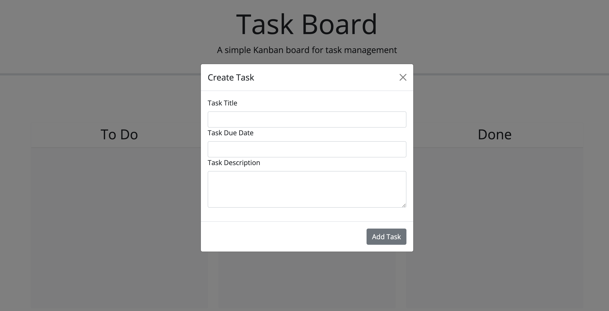
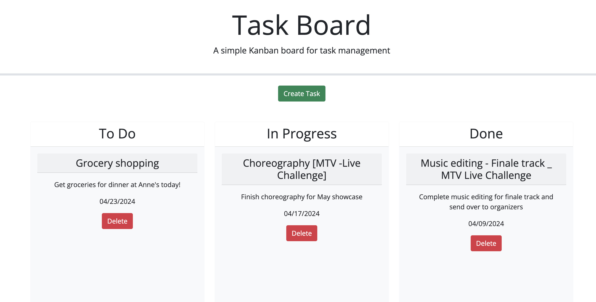

# Task Board Management System

A simple task board application designed to help project team members organize and manage their tasks efficiently. The task board allows users to add individual project tasks, manage their state of progress, and track overall project progress accordingly.

## Table of Contents
- [Features](#features)
- [Installation](#installation)
- [Usage](#usage)
- [Visuals](#visuals)
- [License](#license)
- [Contributing](#contributing)
- [Tests](#tests)
- [Questions](#questions)

## Features
- Display project tasks in columns representing task progress state.
- Color-coded tasks to indicate nearing deadline or overdue.
- Add new tasks with title, description, and deadline date.
- Save task properties in localStorage.
- Update task progress by dragging tasks to different columns.
- Delete tasks from the task board.
- Persistence of saved tasks after page refresh.

## Installation

* Clone the repository: 

        git clone `https://github.com/yourusername/task-board.git`

* Follow the deployed link:

        https://j-0987.github.io/challenge-05/

## Usage

- Open the application in your web browser.

## Visuals
- Modal form for task input

- task display

## License
This project is licensed under the [MIT License](https://opensource.org/licenses/MIT).

## Contributing
Contributions are welcome! If you have any ideas for improvements or new features, feel free to open an issue or submit a pull request.

## Tests
- Describe and show how to run the tests with code examples.

## Questions
If you have any questions or need further assistance, feel free to contact [J.Jasani](mailto:jasminejayeshjasani@gmail.com).
